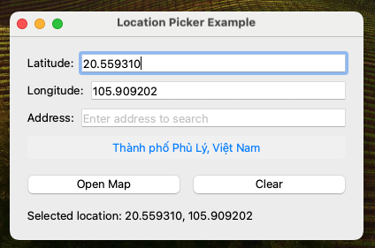
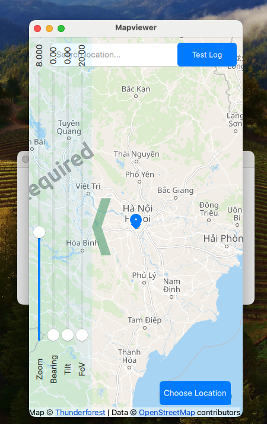
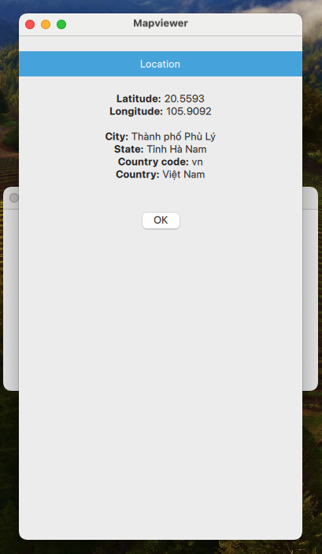

# Map Viewer Application

## Overview
Map Viewer is a modern, QML-based mapping application that provides interactive map visualization capabilities with support for markers and mini-map functionality.

## Screenshots

### Main Interface

### Mini-map Feature

### Marker Interaction

## Features
- Interactive map navigation with smooth pan and zoom controls
- Custom marker support with click interactions
- Mini-map functionality for enhanced navigation and context
- Cross-platform compatibility (Windows, macOS, Linux)
- Built with Qt/QML for high performance
- Python backend integration

## Project Structure
your_project/
├── main.py
├── screenshots/        # Application screenshots and documentation images
└── MapViewer/
    ├── __init__.py
    ├── map_viewer.py
    └── map/
        ├── Main.qml
        ├── MapComponent.qml
        ├── Marker.qml
        └── MiniMap.qml

## Requirements
- Python 3.8+
- PySide6/PyQt6
- Qt 6.2+

## Installation
1. Clone the repository:

git clone https://github.com/yourusername/map-viewer.git
cd map-viewer

2. Create and activate a virtual environment (optional but recommended):
python -m venv env
source env/bin/activate # On Windows: env\Scripts\activate

3. Install dependencies:
pip install -r requirements.txt

## Usage
To run the application:

### Basic Controls
- Pan: Click and drag on the map
- Zoom: Mouse wheel or pinch gesture
- Select Marker: Click on any marker
- Mini-map: Use the overview in the corner for quick navigation

## Contributing
Contributions are welcome! Please feel free to submit a Pull Request.

## License
This project is licensed under the MIT License - see the LICENSE file for details.

## Acknowledgments
- Built with Qt/QML
- Map data provided by [Your Map Provider]